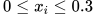

# Markowitz Portfolio Theory Optimization using C++/Python

## Markowitz Portfolio Theory
Modern Portfolio Theory is based on Harry Markowitz’s 1952 work on mean-variance portfolios. The theory is a mathematical framework for assembling a portfolio of assets such that the expected return is maximized.

## Description

The purpose of this application is to find the optimal return of a portfolio which is based on the Markowitz theory and also extract the relevant data set that meets the following constrains:


and


## Inputs
```
Date set : {*x<sub>1</sub>*, *x<sub>2</sub>* . . . *x<sub>n</sub>*}
{
  n : Maximum number of assets
  upper_limmits : Maximum amount of asset proportions
  lower_limmits : Minimum amount of asset proportions
  number_agents : Number of population
  number_iterations : Number of optimizition steps
}

```
The assets are provided in the file ```data.json``` *(n = 8)*.

## Output
```
1. {*x<sub>1</sub>*, *x<sub>2</sub>* . . . *x<sub>n</sub>*} as best solution
2. highest value of the objective function
```

## Implementation environment
The calculation section of this program is written in the language C++ which is imported and invoked as a library by the Python language. The program build operation is performed on Ubuntu operating system.
## Install dependencies
- Create a virtual env and activate it: ```python3 -m venv env; source env/bin/activate```
- Install dependencies: ```pip install -r requirements.txt -r dev-requirements.txt```
- Build C++ code as Python module: ```python3 setup.py install```

## How to run
Run the following command after installing dependencies

```python3 main.py data.json```

## sample run:
```python
>>>> from optimizer.utils import MarkowitzPortfolio
>>>> R = [0.4, 0.4, 0.4, 0.4]
>>>> sigma = [2.09, 1.85, 6.91, 1.13]
>>>> covariance = [[1, 0.0019, -0.0015, 0.001], [0.0019, 1, -0.0031, 0.0009], [-0.0015, -0.001, 1, -0.0003], [0.001, 0.0002, -0.003, 1]]
>>>> m = MarkowitzPortfolio(R=R, sigma=sigma, covariance=covariance)
>>>> x = [0.25, 0.25, 0.25, 0.25]
>>>> m.evaluate_objective(x=x)
0.2502534375
```
## Optimization Algorithm
To find the most optimal answer *Genetic algorithm* has been used. Therefore, we considered assumptions for this algorithm.
### Gene representation
According to the project assumptions, each of our assets should be in the range of 0 to 0.3. Therefore, assuming that the size accuracy of each asset is one hundredth, this range is divided into 31 parts, each of which can be composed of the following characters: 
```C++
const string GENES = "ABCDEFGHIJKLMNOPQRSTUVWXYZabcde";
```
therfore every character has a numerical value:
```
'A' = 0.00
'B' = 0.01
'C' = 0.02
 ...
'c' = 0.28
'd' = 0.29 and
'e' = 0.30
```
As we mention above ```n = 8``` every chromosome is represented as a ```string``` with ```length = 8``` like DbaWTcdZ and Its numerical value is equal to the sum of the numerical value of each character. For example:
```
value(DbaWTcdZ) = 0.2 + 0.3 + 0.8 + ... = 1.2
```

### Presentation ```Class```
We represent every chromosome as a class which called ```Portfolio```
``` C++
class Portfolio {

}
```

### initialize
At First, we randomly generate 20 (```number_agents = 20```) genes that make up our zero generation.

### crossover
After initialization, we separate 10 percent of the population and merge remained genes with a function called ```crossover```:
```C++
void crossover()
```
### mutation


What your application does,
Why you used the technologies you used,
Some of the challenges you faced and features you hope to implement in the future


tozih bede ke mikhasti taghyirati tou algorithm bedi, ya in ke dar halati javab behtari migirim, ya inke behtare tetdade iteration haro bala bebarim ya mahdude ro population ro bishtar konim

# Test operation
Test application 
```python
python3 -M unittest /test

```

# Prod and ...( way to grow alrothm)
algoritm can

### Comment
This algorithm, because there is no exact answer to the problem, provides a more appropriate and better answer by increasing the number of iterations, and of course it can not be claimed that the proposed method is the best choice, because even by changing coefficients or changing input parameters different answers Achieved . Also, random generation of zero generation has a great impact on the result.


### Vision

- To improve the performance of the algorithm, the initialization process can be made more rigorous and only chromosomes can be produced with a total percentage of one. This increases the chances of achieving a better result, but the process of integration and mutation after generation zero will still be limited.
- Since we must always consider a portfolio as the correct result that is the sum of the capital equal to one, so this limits the calculation space and one of the solutions to compensate for this limitation is to increase the number of iterations. For example, the sum of the elements can be in the range of 0.01 or 0.02, and only when we want to return the best result to establish the condition of being with one image.


# Run Application
agar betuni parametere debug ro ezafe koni kheili behtare
python3 main.py data.json
